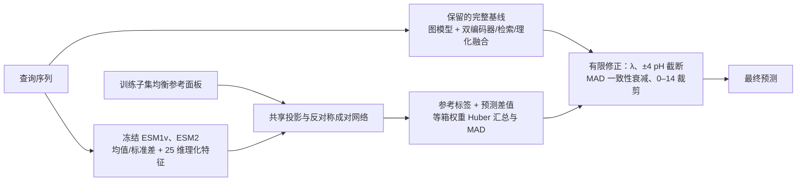

# ΔRef-pH 实现与实验协议

本模块实现用户冻结的参考酶差值学习方案。当前是实验候选；默认完整预测器仍保留。代码通过与性能达标是两项不同验收，最新运行状态见 `experiments/delta_ref_phopt_20260916/status.json` 和 `REPORT.md`。

## 运行环境与入口

工作目录 `/home/hetianci/projects/Venus-DREAM`，解释器 `/home/hetianci/envs/miniforge3/envs/phbench/bin/python`。优先 RTX 3090 Ti 单卡，未配置自动多卡转移。

```bash
conda activate phbench
python -B -m unittest discover -s tests -p 'test_delta_ref*.py' -v
python -B -m unittest discover -s tests -p test_phgeofuse.py -v
python -B -m phgeofuse.delta_ref audit --config configs/delta_ref_phopt.yaml
python -u -m phgeofuse.delta_ref run --config configs/delta_ref_phopt.yaml
python -m phgeofuse.delta_ref status --config configs/delta_ref_phopt.yaml
# 后台持续运行，PID/日志保存在实验目录，重复启动会拒绝：
python scripts/launch_delta_ref.py --config configs/delta_ref_phopt.yaml
```

`audit` 写入不可变输入/源码/完整基线依赖哈希。`run` 有互斥锁；中断后用相同命令恢复，已完成子集只有在训练键、查询键、同源分组、排除折、配置和输入哈希匹配时才复用。旧引擎恢复不完整随机状态，因此未完成的图模型拟合保留旧尝试并从固定种子在新目录重训；未完成的小型差值/LoRA 拟合同样从固定种子重新开始。修改协议后必须使用新的实验目录，不能覆盖已冻结元数据。

独立子集训练：

```bash
python -m phgeofuse.delta_ref train --config configs/delta_ref_phopt.yaml \
  --fit-folds 1 2 3 4 --validation-fold 0 --width 64 --power 0.5 \
  --seed 42 --output experiments/delta_ref_manual_subset
```

冻结后预测不接收查询 pH、EC 或实验条件：

```bash
# 最终包显式引用其保留的完整基线包、图模型检查点与训练参考库。
python -m phgeofuse.delta_ref predict \
  --bundle experiments/delta_ref_phopt_20260916/final/seed42 \
  --fasta queries.fasta --output predictions.csv

# 独立差值分支：NPZ 仅含 keys、features，features 为 N×5145。
python -m phgeofuse.delta_ref predict --bundle path/to/bundle \
  --features queries.npz --baseline-predictions complete_baseline.csv \
  --output predictions.csv
```

FASTA 输入内部仍使用原基线的结构、SaProt 和检索流程。结构准备失败时报告全部失败记录并停止，不静默删除样本。`--online` 允许原有结构下载流程；冻结 PLM 权重仍取已核验的本地缓存。ESM1v/ESM2 残基池化按最多 1022 残基分块覆盖全序列。CPU 推理用 float32，与原始 CUDA 精度不同，会记入来源信息。LoRA 缓存预测还须携带 `adapter_sha256`，禁止将冻结表征误当成已适配表征。

输出包含 `baseline_prediction`、`transfer_prediction`、`dispersion`、`agreement`、`correction`、`prediction`、`fallback`、`fallback_reason`。参考少于三个不同家族时返回基线，原因为 `fewer_than_3_distinct_reference_families`。一致性不是校准后的置信概率。

## 模型路径



成对输入为投影后的查询、参考、差值及逐元素乘积；两个方向共享网络，输出反对称差值。训练时两个方向使用同一 dropout 掩码，因此自比较严格为零；部署时反对称性确定成立。查询/参考标签不进入成对网络输入。标准化只拟合当前训练子集；面板按 1 pH 分箱，每箱最多 8 个不同同源组，冻结表征最远点采样，按键排序打破并列。查询排除后重新保持各剩余非空箱的总权重。

## 冻结实验与选择规则

- 原始 PHOPT：7124/760/1971，不增标注。开发 seed 42；最终 seed 0、1、2、3、42。极端为 pH≤4 和 pH≥10。
- 五外层、四内层同源分组；每个被排除集合都重训完整基础预测器、差值头，并重建训练参考面板、标准化、检索库。完整旧检查点仅用于最终全部训练样本拟合后的基线复现。
- 完整基线图分支固定历史第 5 个 epoch，保留原始 40 epoch 学习率调度范围。v3 门控残差系数经核验为 0，共享权重等于 tuned-v1；因此不训练对输出无效的残差门控。引擎需要非空验证 loader，使用一个训练样本作探针，但探针不选择模型，始终读取固定 epoch 的 `last.pt`。
- 首轮四配方：64/128 维 × 标签频率权重指数 0/0.5。两层 GELU、dropout 0.1、AdamW、lr 3e-4、weight decay 1e-3；60 epoch 上限、patience 8。每查询 8 对参考，4 自然、4 按箱均衡，参考来自不同外部家族。差值平方损失，权重上限 3。
- 在整体/中心 RMSE 和 MAE 增幅≤0.01、中心错误极端率增幅≤0.005 的约束下，先最小化两端相对 RMSE 的较大值，再比较整体 RMSE、λ。λ=0、0.1、…、1。
- 四个冻结表征配方均不能在护栏内同时改善两端时才触发一次最后四层 query/value、rank 8 ESM2 LoRA。每个外层只继承该外层内部选择的冻结配方，禁止借用全开发集选出的头参数；最终部署参数才使用全开发集结果。
- LoRA 只更新差值支路；前 29 层输出按无标签序列缓存为 float32，最后四层梯度检查点，微批 1 对、累积 16。预先记录实测显存、每 epoch 耗时估计。冻结前缀采用 bf16 CUDA 计算，与原冻结特征的 fp16 数值条件略有不同，属于整个 LoRA 表征消融的一部分。
- 内部验收仍要求两端 RMSE/MAE 至少改善 10%、绝对偏差至少改善 20%。若仅有轻微双端改善但未达内部验收，按原触发条件不会追加 LoRA 搜索，保留基线并报告未达标。
- 达标后才进行五种子固定 epoch 重训，原始验证集作护栏/双端方向复核。通过后写入 `frozen_release.json`，显式 `evaluate` 及自动后续评估均须通过冻结哈希与资格检查；测试不得反向选择配方。

主测试固定数值上限：整体 RMSE 0.78271、MAE 0.56420；酸端 RMSE 1.50566、MAE 1.17960、绝对偏差 1.00610；碱端 RMSE 1.99925、MAE 1.86109、绝对偏差 1.65431。中心护栏另行应用。绝对偏差为各 seed 内 `abs(mean(pred-y))`，之后再跨 seed 求均值；集成预测指标不能替代此值。

## 消融、对照与统计

已实现同表征近参数量直接回归、可加差值、自然分布参考面板、去一致性、去基础模型、仅仿射拉伸。直接/可加模型在各自内部交叉验证选择配方；每个外层的自然面板、去一致性和拉伸强度也仅使用该外层内部预测。自然面板保持参考总数，按训练自然分布分配名额、逐参考等权。

双编码器 Ridge α=0.2、历史紧凑残差 `l3_i50_p0.0` 已接入子集交叉拟合和最终五种子包；确定性 Ridge 各种子相同，会明确记录。直接回归同时报告独立输出和保留基线修正输出，避免把普通集成收益误记为差值机制收益。

外部复现的登记入口：

```bash
python -m phgeofuse.delta_ref register-comparison --manifest comparator_manifest.json
python -m phgeofuse.delta_ref compare \
  --candidate c0.csv c1.csv c2.csv c3.csv c42.csv \
  --baseline b0.csv b1.csv b2.csv b3.csv b42.csv \
  --families families.csv --draws 10000 --output comparison.json
```

比较清单须包含 `method`、`information_condition`（PHOPT-only 或 extra-task-pretraining）、`training_keys_sha256`、`manifest_sha256`、`source_hashes`、`checkpoint_hashes`、`selection_protocol`、五个 `prediction_files`、`seeds`、`retrieval_training_only`。必须在候选最终冻结前登记；登记校验文件和键来源，但不能替代对外部训练代码的审查。额外任务预训练单独列示。

评估按键检查全部种子的标签/预测对齐，报告各模型完整可用覆盖率、缺失极端样本及共同样本。测试家族由仅序列的 MMseqs 30% identity、双向 80% 覆盖连接分量生成，完全相同序列必合并；搜索失败不退化为逐样本 ID。搜索是启发式，未检出不能证明不存在同源。

10,000 次配对家族 bootstrap，每次家族重采样复用于所有模型、种子与端点；比较跨 seed 的指标均值。酸/碱 × RMSE/MAE/绝对偏差 × 全部对照使用 Bonferroni 同时区间，另报普通 95% 区间。未含尾部的抽样作缺失；有效抽样不足 95% 时不支持优势结论。开发期统计仅为探索性，测试早已历史查看，当前测试明确标为 follow-up。更强的独立泛化表述需要冻结后的外部数据。

## 实际核查范围内的设计差异

| 方法 | 核查材料 | 与本分支的联系和差异 | 同协议复现状态 |
|---|---|---|---|
| 当前完整模型 | 本地代码与包 | 原基线原样保留在路径中；ΔRef 为独立修正支路 | 子集完整重训已实现，首个子集完成 |
| EpHod | 官方库、本地 RLAT 权重、论文材料 | ESM1v、残差轻注意力、SVR；与 PLM 基础共享，差值支路没有复制 RLAT | 未完成；官方任务权重含额外 pHenv 监督，不能假作 PHOPT-only |
| Venus-DREAM | 本仓库代码、论文正文 | 标注支持酶 + Reptile；本分支通过反对称差值监督转移参考标签，不在查询时更新模型 | 未完成；原始划分支持集已确认全部来自训练集；已完成 [初始化审计](venus_phopt_initialization_audit_20260916.md) 和 [评估状态修复](venus_phopt_evaluation_audit_20260917.md)；残基缓存及五种子完整重训仍需完成 |
| OpHReda | 固定提交的公开模型/检索代码、作者 README；全文未取得 | 邻居表征、标签、相似度进入 MEA 注意力，后接残基修正；本分支的标签只在差值转移/聚合端使用，无检索标签注意力 | 未完成；三阶段训练与预训练资源尚未形成经核验的 PHOPT-only 包 |
| EnzOracle | 预印本摘要 | 明确针对极端条件均值收缩的分类引导 MoE；本分支不使用类别路由/多专家 | 仅设计审查，不声称全文不存在差值机制 |
| pHoptNN | 2026 正式正文 | 原子电荷/等变图；与保留的结构基线有主题重叠，新增支路不另建静电图 | 仅设计审查；EnzyBase12k 原论文分数不混入 PHOPT |
| DeepPH | 摘要、作者 README | 序列/结构、E(3)、注意力与 pH 区间；ΔRef 不把一致性当概率区间 | 仅设计审查 |

来源与证据深度详见 [已有文献核查](literature_phopt_20260915/RESEARCH_GAP_ZH.md)。直接来源：[EpHod](https://doi.org/10.1038/s42256-025-01026-6)、[Venus-DREAM](https://doi.org/10.1021/acs.jcim.4c02291)、[OpHReda 代码](https://github.com/RIA-lab/OpHReda/blob/66715f87815e5640217f1d647e3734f181467e32/models/ophreda.py)、[EnzOracle](https://doi.org/10.64898/2026.06.02.729708)、[pHoptNN](https://doi.org/10.1021/acs.jcim.6c01482)、[DeepPH](https://doi.org/10.1109/JBHI.2026.3729250)。

差值学习是已有通用技术。只有在同容量直接回归、可加差值、普通集成、权重和参考分布消融均充分解释后，仍有额外、可复现收益，才讨论组合机制的领域贡献。当前资料范围不能证明全领域不存在相似设计。领域强基线比较缺失、区间不能支持优势、或数值门槛不通过时，均不替换默认模型、不宣称领先。

## 产物目录

`baseline/seed42/excluded_*`：完整子集模型、检索、内层来源和预测；`frozen/`：四配方的 5×4 训练、外层选择、OOF 预测；`ablations/`：消融；`comparisons/`：Ridge/紧凑/直接对照及外部复现清单；`lora/`：仅触发时生成；`final/seed*/`：五种子差值包、参考标签面板、标准化与曲线；`followup_test/`：冻结后逐样本输出、测试家族链接、覆盖率与同时 bootstrap；`smoke/`：实现/显存测试，绝不作性能证据。

## 2026-09-16 实施检查

21 项 ΔRef/流水线测试、36 项原 PHGeoFuse 测试通过。关键隔离测试在改变外层标签后检查该外层内层选模及最终权重完全不变；后续测试入口拒绝未通过验收的模型；合成五种子评估实际写出全部输出且保持领域比较缺失时的发布门槛。

真实冻结特征训练冒烟：256 条训练、16 条查询、2 epoch、345,984 个头参数，检查点重载一致。真实 FASTA 两条验证序列：冻结表征最大绝对差为 0，完整基线输出最大绝对差约 0.000125 pH（BF16 图运算数值容差）。真实 ESM2 最后四层 LoRA：64 对资源测试约 8.45 秒，峰值分配显存 3,106,326,016 字节；完整覆盖 1031 残基输入。该小型资源探针不进入配方选择，头/adapter 不作为任何正式实验初始化。

首个完整基线子集已重训完成：排除折 0、1，4274 条训练、2850 条查询、1274 个查询家族，用时 1413.84 秒。完整运行器随后已启动 5×4 实验。**这些检查尚不能说明极端收缩已解决，也尚未产出合格的五种子新模型或领域强基线优势。** 当前 EpHod、Venus-DREAM、OpHReda 受控复现仍未完成；模型替换保持关闭。
